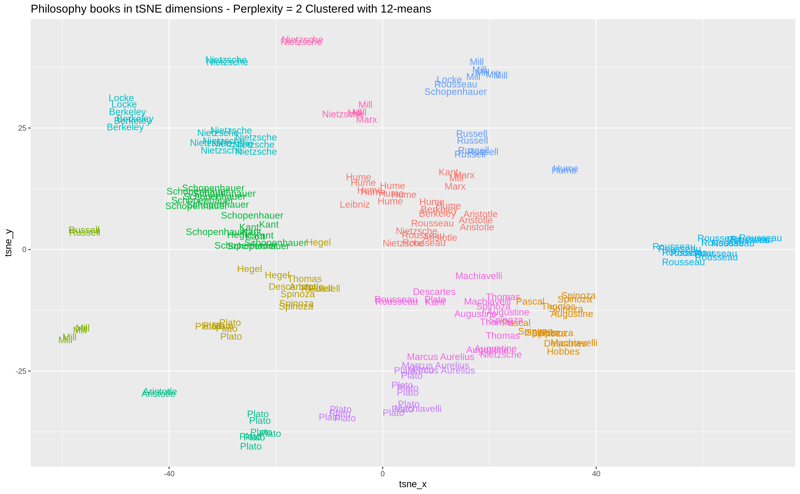

# Philosophy books clustering

The main goal of this project is analyse similarities between philosophy authors using  text mining, dimensionality reduction and clustering techniques in order to explore relations among the books. 

# Running

In order to reproduce this work you only need to change the paths to your local machine and run in this order:

01.preprocessing.R

02.pca_components_choice.R

03.k_means_clustering.R

04.tsne_exploration

All analysis and plots are produced with these scripts, and the final report, avaliable in https://rpubs.com/araujoamf/philosophy-tsne-clustering is the report.Rmd.

# License

This project is licensed under the MIT License 
